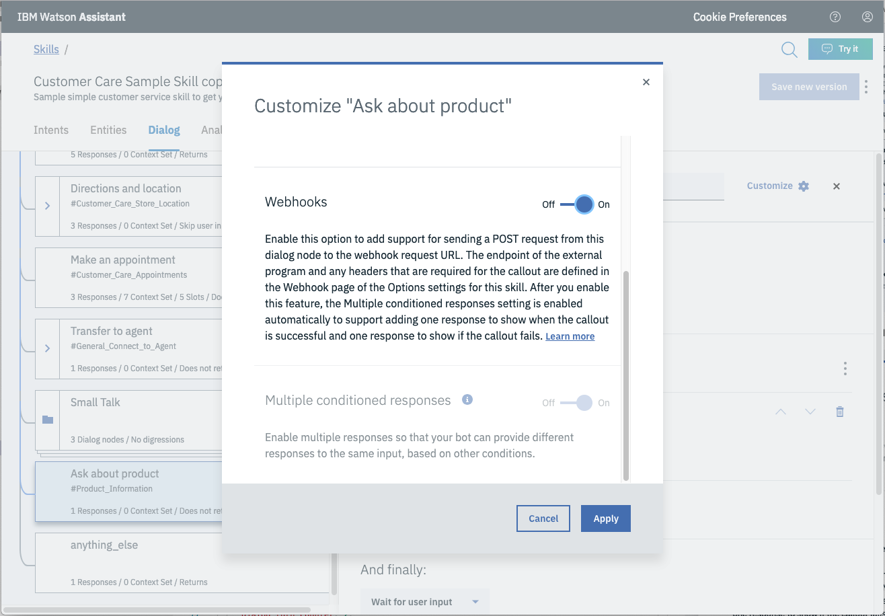
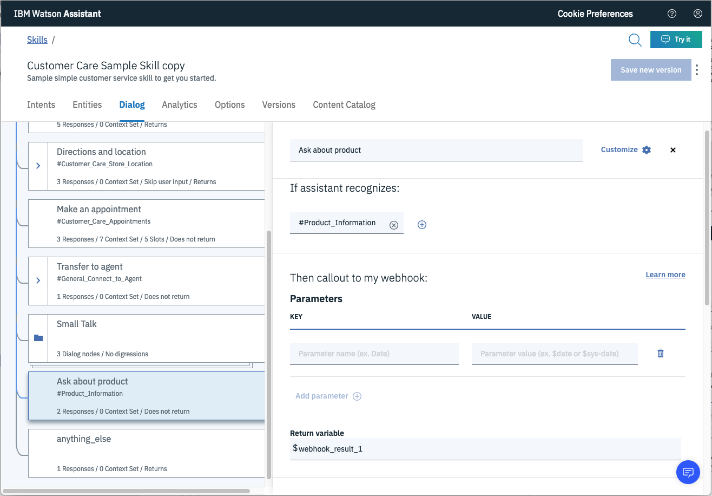

# composite-disco-sdu-assistant-chatbot-with-webhooks

* Use Assistant dialog for better chatbot experience
* Use "customer-care" skill provided by Assistant
* Use webhooks to search Disco if question is "anything-else" and reply with disco passages

# What is a webhook?

Define a webhook that sends a POST request callout to an external application to perform a programmatic function. You can then invoke the webhook from one or more dialog nodes.

A webhook is a mechanism that allows you to call out to an external program based on something happening in your program. When used in a dialog skill, a webhook is triggered when the assistant processes a node that has a webhook enabled. The webhook collects data that you specify or that you collect from the user during the conversation and save in context variables, and sends the data to the Webhook request URL as an HTTP POST request. The URL that receives the webhook is the listener. It performs a predefined action using the information that is provided by the webhook as specified in the webhook definition, and can optionally return a response.

# Differences between Webhooks and simple Cloud Functions

* No code required inside dialog node
* Webhooks requires setting once per skill, so can be used in multiple dialog nodes
* Setting action URL is easier (cut and paste). No need to parse and decode.
* Creds for webhooks in one place and easily set. No need to pass them into Assistant.

# TODO:

* Remove references to calling Disco directly
* Add action creds to .env
* Create better use case for invoking action from a real Assistant dialog node
* Format Disco results better in chatbot 

# Steps:

## Create action

> Note: additional notes in https://github.com/rodalton/watson-functions

* From IBM Cloud resource list, create `New` and select `Functions`.
* Click on `Actions` tab.
* `Create` and then `Create Action`.
* Provide unique `Action Name`, keep default package, and select `Node.js 10` runtime.
* Add code to action - use code in `/actions/disco-action.js`.


* Note your endpoint:


* The `curl` command should work, if the params you entered are correct for the disco collection.

## Enable webhook from Assistant

* Set up access to WebHook for this skill:


* In the cell you want to trigger action, click on `Customize`, and enable Webhooks for this node:



* Then you can add params, change name of return variable, etc.



## Test in Assistant Tooling

* Using the `Try it` feature, add the context variable `my_creds` and see if it works (probably won't return anything meaningful in the test window, but you should NOT get an error due to credentials).

> Note: You must enter a response to trigger the assistant dialog node that calls the action.


{"user":"7a4d1a77-2429-43b1-b6ed-a2b438e15bea","password":"RVVEdpPFLAuuTwFXjjKujPKY0hUOEzt6nQ6O7NwyonHeF7OdAm77Uc34GL2wQHDx"}

These values are pulled from the `Functions` action panel, click on `API-KEY` which then takes you to the `API Key` panel, where the key is found:

```bash
7a4d1a77-2429-43b1-b6ed-a2b438e15bea:RVVEdpPFLAuuTwFXjjKujPKY0hUOEzt6nQ6O7NwyonHeF7OdAm77Uc34GL2wQHDx
```

> Note: the value before the `:` is the user, and after is the password. Do not include the `:` in either value.

## Access to results in application

* Results will be returned in Assistant context object:

```json
{ conversation_id: "b59b187a-f4b7-4fe7-81ef-29073abbb8ee",
  system: 
   { initialized: true,
     dialog_stack: [ { dialog_node: 'root' } ],
     dialog_turn_counter: 2,
     dialog_request_counter: 2,
     _node_output_map: { node_15_1488295465298: [ 0 ] },
     last_branch_node: "node_2_1467831978407",
     branch_exited: true,
     branch_exited_reason: "completed" },
  webhook_result_1:
   { activationId: "88167283e985494b967283e985894b7e",
     annotations:
      [ { key: "path", value: "IBM Cloud Storage_dev/disco-action" },
        { key: "waitTime", value: 64 },
        { key: "kind", value: 'nodejs:8' },
        { key: "timeout", value: false },
        { key: "limits",
          value: { concurrency: 1, logs: 10, memory: 256, timeout: 60000 } } ],
     duration: 899,
     end: 1556222972039,
     logs: [],
     name: "disco-action",
     namespace: "IBM Cloud Storage_dev",
     publish: false,
     response:
      { result:
         { matching_results: 9,
           passages:
            [ { document_id: "3a5efee70d8cc9d70e2b94d22c15e2d1_2",
                end_offset: 2791,
                field: 'text',
                passage_score: 6.752501692678998,
```
